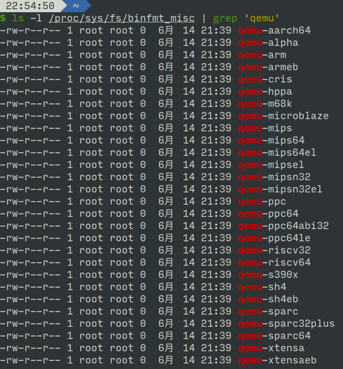
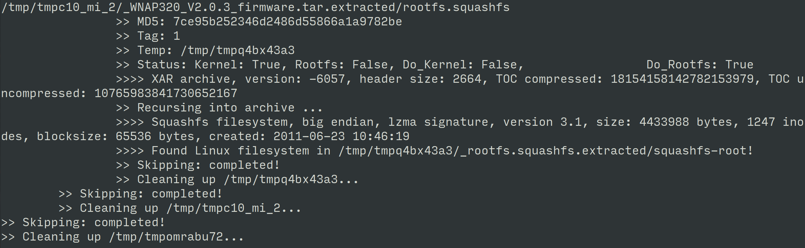
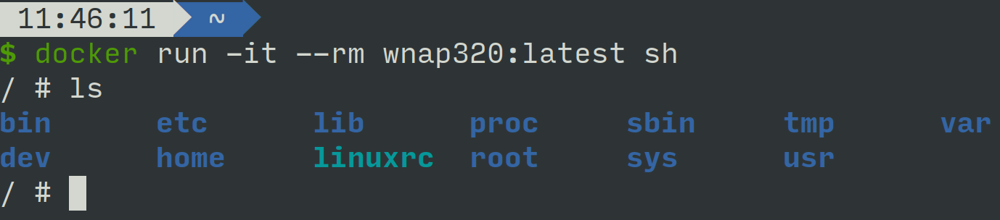

#### 物聯網裝置(Netgear WNAP320 AP)模擬
在這次的實作中，我們選擇使用Docker搭配QEMU模擬無線AP裝置
#### 執行問題
- IOT裝置模擬耗時且複雜(CPU架構不同)
- 裝置韌體須透過特殊方法才能將架構解析
#### Docker
- Docker可以讓我們建立起的模擬裝置更加容易執行，分享，以及修改
- 在Docker中可以安全地模擬惡意軟體以及感染裝置
#### Firmadyne
- 可以用來解析韌體，將Filesystem提取出來
- TODO: 可補充rootfs的介紹
#### QEMU
- Open source的裝置模擬器
- User space emulation可以模擬不同架構的裝置，對於大部分採用MIPS/ARM架構的IOT裝置模擬十分有幫助
- 有提供許多的架構支援\

#### 實驗步驟
- 安裝QEMU
```
sudo apt-get install qemu-system-arm qemu-system-mips qemu-system-x86 qemu-utils
```
- 設定模擬器
```
docker run --rm --privileged multiarch/qemu-user-static --reset -p yes
```
- 取得模擬裝置韌體
    - 在 Netgear 官網下載 WNAP320 v2.0.3版韌體
- 利用 Firmadyne 提取 rootfs
```
cd Firmadyne
python sources/extractor/extractor.py -b Netgear -sql 127.0.0.1 -np -nk Netgear-Firmware.zip images
```
    - 提取成功:

- 建立Dockerfile
```
FROM multiarch/debian-debootstrap:mips-buster-slim as qemu

FROM scratch
ADD ./1.tar.gz /
COPY --from=qemu /usr/bin/qemu-mips-static /usr/bin
CMD ["/usr/bin/qemu-mips-static", "bin/busybox"]
ENV ARCH=mips
```
- Build Docker
```
docker build --rm -t netgear_docker -f Dockerfile .
```
- 執行模擬裝置中的shell
```
docker run -it --rm --privileged netgear_docker:latest sh
```
